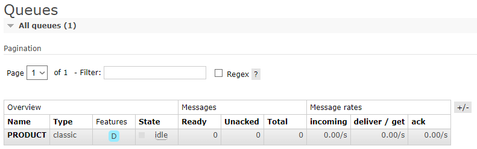

<h1 align="center">
    
</h1>

<h1 align="center">
    
</h1>

# Índice

- [Sobre](#-sobre)
- [Tecnologias utilizadas](#-tecnologias-utilizadas)

## 🔖 Sobre

Este serviço possui como objetivo produzir mensagens para o RabbitMQ através da fila `PRODUCT`.

---

## 💻 Tecnologias utilizadas

O projeto foi desenvolvido utilizando as seguintes tecnologias:

- [Java](https://dev.java)
- [Spring Framework](https://spring.io)
- [RabbitMQ](https://www.rabbitmq.com)

---

<h3 align="center">
  Feito com ❤️ por Leonardo Santana
</h3>
